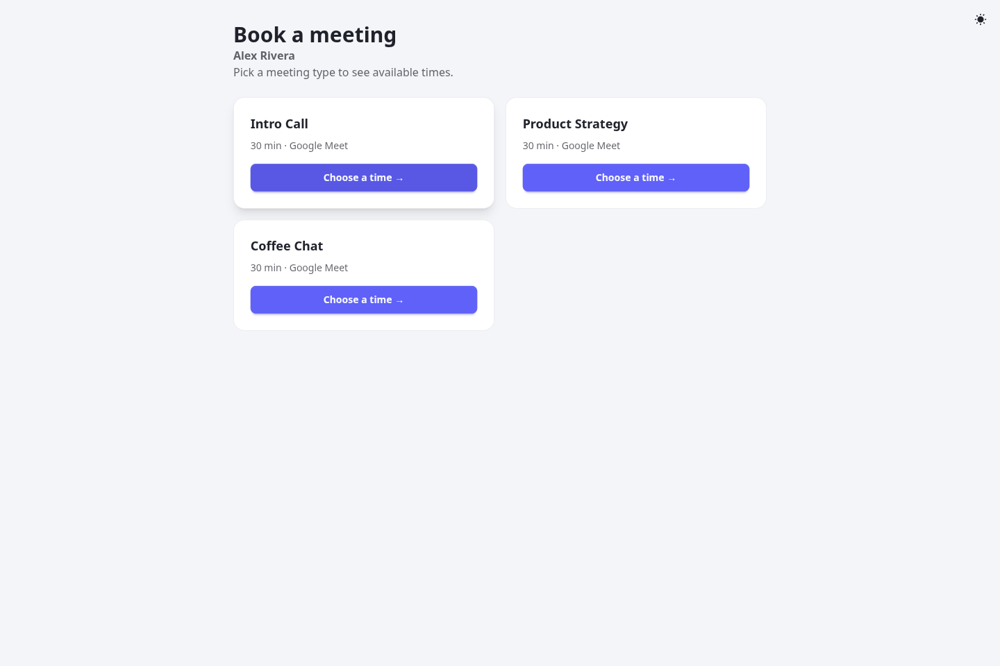
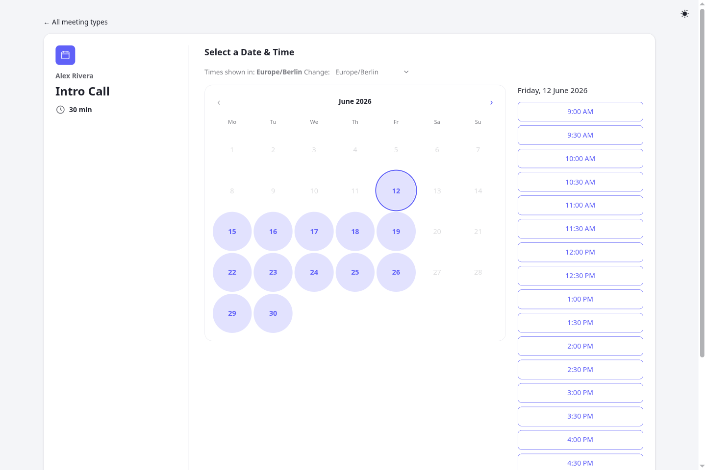
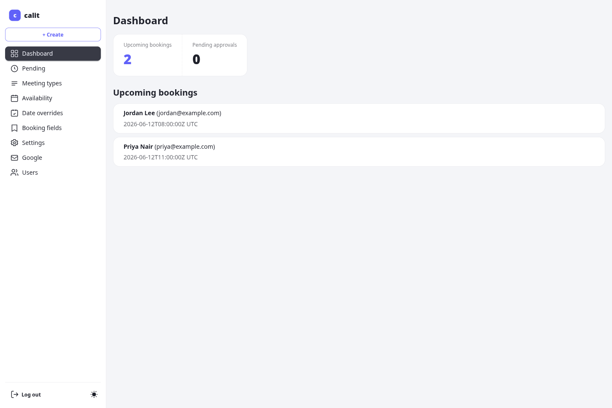
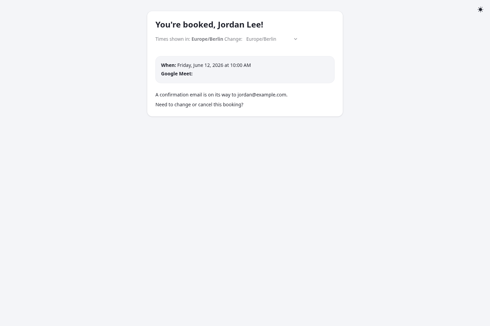

# calit — self-hosted Calendly alternative

[](https://github.com/asm0dey/calit/actions/workflows/ci.yml)
[](https://github.com/asm0dey/calit/releases/latest)
[](https://github.com/asm0dey/calit/pkgs/container/calit)
[](https://asm0dey.github.io/calit/)
[](LICENSE)
[](https://quarkus.io)
[](https://bell-sw.com/libericajdk/)

**calit** is a self-hosted, multi-user scheduling app — a Calendly alternative built on Quarkus. Every
user runs their own independent scheduling page at `/<username>/<slug>`: isolated meeting types,
availability, bookings, settings, and Google account. Invitees pick a slot and book; bookings
optionally sync to Google Calendar (auto Meet link) and email both parties. Pages are server-rendered
with **no runtime JavaScript required**, and it runs as **N stateless replicas** behind a load
balancer with all shared state in Postgres.

Features: per-type buffers, min-notice / booking-horizon, date-specific availability overrides, an
approval workflow, custom booking-form fields, reminder emails, multi-user tenancy with per-user
owner-scoping (argon2id passwords), site-admin user management, optional **Google Calendar** sync,
optional **OIDC / SSO** login, and public-form abuse protection (Cloudflare Turnstile **or**
self-hosted ALTCHA, plus honeypot + per-email daily cap). UI localised to **en / de / he**.

## 📖 Documentation

**Full docs — install, configuration, reverse-proxy, Google / Turnstile / ALTCHA / OIDC setup, usage,
and changelog — live at <https://asm0dey.github.io/calit/>.** This README is intentionally short; the
site is the source of truth.

## Screenshots

| Public landing | Booking page |
|---|---|
|  |  |

| Owner dashboard | Booking confirmation |
|---|---|
|  |  |

## Run it

Prebuilt multi-arch images are published to **`ghcr.io/asm0dey/calit`** (tags: `latest`, `1.18.0`,
`1.18.0-native`). The fastest path is Docker Compose:

```bash
cp .env.example .env    # set at least DB_PASSWORD, SESSION_ENCRYPTION_KEY, APP_BASE_URL, MAIL_*
docker compose up -d    # pulls the image; Flyway migrates on boot
```

Full self-hosting instructions (compose file, required/optional env vars, reverse proxy, scaling,
upgrade notes) → **[Installation docs](https://asm0dey.github.io/calit/)**.

## Develop

Prereqs: **JDK 26** (build; the app targets Java 25), **Bun** (CSS), and **Docker** (Dev Services
provisions a throwaway Postgres + mock mailer for dev and tests).

```bash
bun install            # once — installs the Tailwind/daisyUI CLI + wires the lefthook pre-commit hook
bun run css:watch &    # compiles src/main/css/input.css -> /calit.css (gitignored; build once)
mvn quarkus:dev        # dev server at http://localhost:8080  (Docker must be running)
mvn test               # full suite (Docker required)
```

On a fresh database, any page redirects to `/setup` to create the first (admin) user — there is no
default password. See **[CONTRIBUTING.md](CONTRIBUTING.md)** for the full contributor guide (testing,
formatting, i18n, migrations, docs).

## License

Licensed under the **GNU Affero General Public License v3.0** (AGPL-3.0) — see [LICENSE](LICENSE). If
you run a modified version as a network service, you must offer its complete source to that service's
users.

"Calendly" is a trademark of Calendly LLC. calit is an independent, self-hosted project **not
affiliated with, endorsed by, or sponsored by Calendly**; the name is used only descriptively.
